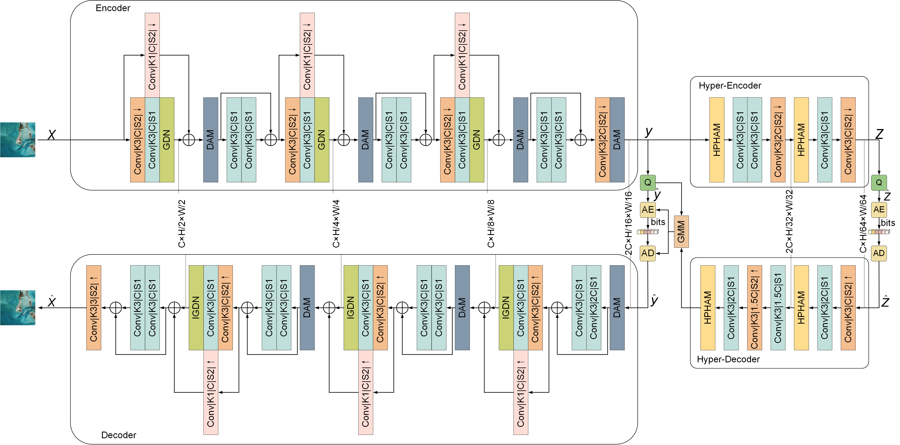

# A Low-Complexity Transformer-CNN Hybrid Model Combining Dynamic Attention for Remote Sensing Image Compression

## Abstract
Deep learning-based methods have recently made enormous progress in remote sensing image compression. However, conventional CNN is complex to adaptively capture important information from different image regions. In addition, previous transformer-based compression methods have introduced high computational complexity to the models. Remote sensing images contain rich spatial and channel information. The effective extraction of these two kinds of information for image compression remains challenging. 
To address these issues, we propose a new low-complexity end-to-end image compression framework combining CNN and transformer. This framework includes two critical modules: the Dynamic Attention Model (DAM) and the Hyper-Prior Hybrid Attention Model (HPHAM). By employing dynamic convolution as the core part of the DAM, the DAM can dynamically adjust the attention weights according to the image content. 
HPHAM effectively integrates non-local and channel information of latent representations through the parallel running of Gated Channel Attention (GCA) and multi-head self-attention. Experiments demonstrate that the proposed approach outperforms existing mainstream deep-learning image compression approaches and conventional image compression methods, achieving optimal rate-distortion performance on three datasets.

## Architectures
The overall framework.


## Install

The latest codes are tested on Ubuntu16.04LTS, CUDA10.1, PyTorch1.2 and Python 3.7

You should install the libraries of this repo.

```sh
pip install -r requirements.txt
```


### Train

For high bitrate (1024, 2048, 4096), the out_channel_N is 256 and the out_channel_M is 256 in 

`'config_1024_256.json', 'config_2048_256.json', 'config_4096_256.json'`

For low bitrate (128, 256, 512), the out_channel_N and the out_channel_M is 192 in 

`'config_128_192.json', 'config_256_192.json', 'config_512_192.json'`

Each json file is at path `./examples/example/`.

For low bitrate of 512, you can train models with following codes.

```python
python train.py --config examples/example/config_512_192.json -n baseline_512 --train flick_path --val kodak_path
```

flick_path is the training data path.

kodak_path is the validation data path.

Finally you can find you model files, log files and so on at path`./checkpoints/baseline_512`

You can change the name `baseline_512` for others.

And the high bitrate training process follows the same strategy.

### Test

If you want to test the model, for low bitrate of 512, you can follow the codes.

```python
python train.py --config examples/example/config_512_192.json -n baseline_512 --train flick_path --val kodak_path --pretrain pretrain_model_path --test
```

pretrain_model_path is your pretrained model file path.

## Citation
If you find this project useful for your research, please consider citing:
```
@article{wang2024ltchm,
  title={A Low-Complexity Transformer-CNN Hybrid Model Combining Dynamic Attention for Remote Sensing Image Compression},
  author={Lili ZHANG, Xianjun WANG, Jiahui LIU and Qizhi FANG},
  journal={Radioengineering},
  year={2024}
}
```